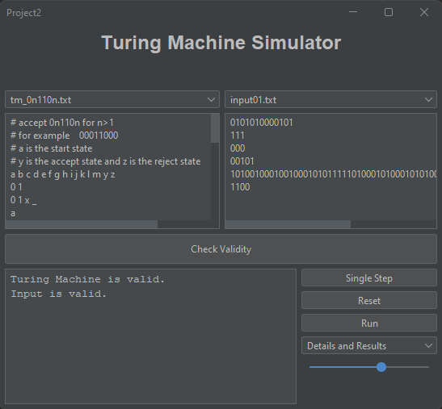
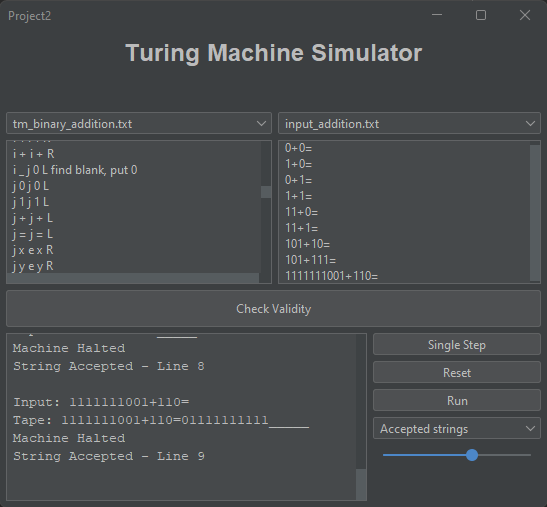
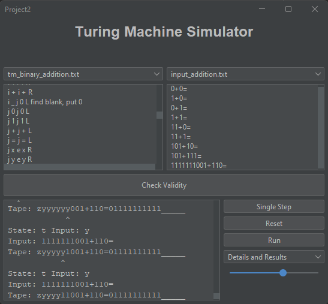
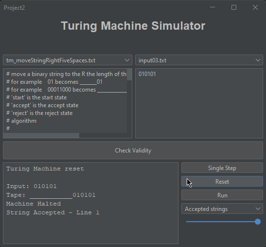

# turing-machine-simulator
A Java program that simulates a Turing Machine, using a versatile proprietary language.

## What is a Turing Machine?
In simple terms, a Turing machine is an abstract mathematical model of computation named after the British mathematician and computer scientist Alan Turing. It's not an actual machine but a theoretical concept that helps us understand the fundamental principles of computation.

## How does it work?
Imagine a tape divided into cells, and each cell can contain a symbol (like 0 or 1). The tape extends infinitely in both directions. The Turing machine has a read/write head that can move left or right along the tape, reading the symbol at the current cell and writing a new symbol.

The machine operates based on a set of rules that define its behavior. These rules specify what action to take (e.g., move left, move right, write a symbol) depending on the current state of the machine and the symbol it reads. The combination of the current state and the symbol under the read/write head determines the next state and the machine's next action.

In essence, a Turing machine follows a set of instructions to manipulate symbols on the tape, and through this process, it can perform any computation that can be algorithmically described.

## How to use this simulator
This simulator allows you to experiment with a simple Turing machine. You can define the machine's initial configuration, set its rules, and observe how it processes input. If you're new to Turing machines, start with the provided examples and gradually explore more complex configurations.

## Defining the language
Each Turing Machine file is written as a series of predefined lines of code:

**Line 1**: The set of states, separated by one space
  ex. a b c d e f g 
  
**Line 2**: The input alphabet
  ex. 0 1 2
  
**Line 3**: The tape alphabet (including the blank character)
  ex. 0 1 2 _
  
**Line 4**: The start state (one)
  ex. a
  
**Line 5**: The accept state (one)
  ex. g
  
**Line 6**: The reject state (one)
  ex. f
  
**Line 7-∞**: The Delta function, in the form CURRENT_STATE CURRENT_CHARACTER NEXT_STATE CHARACTER_TO_WRITE DIRECTION

  ex. a 0 a 1 R (if at state 'a', and receive current input index '0', write '1' and travel right one character on input)
  
  ex. a 1 a 0 L (if at state 'a', and receive current input index '1', write '0' and travel left one character on input)

## Example 
To provide a better example of how this program works, here are some compiled Turing Machines and their results.

### Example 1 - Check validity of the Turing Machine code and the provided inputs
This program is designed using heavy pattern recognition to avoid errors in compilation or execution. 

### Example 2 - Binary addition
Binary addition in a Turing Machine is a very complex algorithm. This optimized algorithm requires 22 states and 4 inputs for each state. In this case, we selected "Accepted strings" to only show the results of the execution.

### Example 3 - Binary addition (cont.)
In this image, the output window outlines the current state, current input character, current input, current tape, and the position to which the tape is currently being read. 

### Example 4 - Move string to the right 5 spaces + length of the string
This Turing Machine takes an input and shifts it right on the tape the length of the string and then 5 spaces. This could be used for a more complex algorithm that requires string modification.

## Conclusion
Since Turing Machines are not physically possible (as a tape of infinite length can never exist), it is much easier to virtually demonstrate the capabilities of the Turing Machine. In this case, we do not have unlimited memory, but we can use memory management to pretend we do. Therefore, it is a great exercise to show the ability of these machines.
